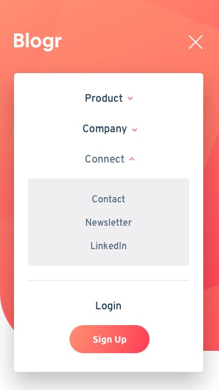

# Blogr Landing Page

A fully responsive landing page built to showcase modern layout techniques, responsive design, and interactive elements.  
This project replicates the Blogr platform marketing site, including dropdown menus, a mobile hamburger menu, and smooth section transitions using HTML, CSS, and JavaScript.

## 🌐 Live Demo  
[👉 View Online](https://vanta-zjm.github.io/blogr-landing-page/)

## 📸 Preview  

## 🛠️ Built With
- HTML5
- CSS3 (Flexbox, Grid, Media Queries)
- JavaScript ES6
- Responsive design with mobile-first workflow
- Smooth dropdown animations

## ✨ Key Features
- ✅ Interactive dropdown navigation with hover animations  
- ✅ Fully functional mobile hamburger menu with overlay  
- ✅ Pixel-perfect responsive design for desktop, tablet, and mobile  
- ✅ Gradient backgrounds and modern layout structure  
- ✅ Accessible buttons and semantic HTML structure  

## 💡 What I Learned
- Structuring complex layouts using **flexbox and grid**  
- Building fully responsive pages with **media queries**  
- Managing **dropdown states** and animations in pure JavaScript  
- Creating scalable, maintainable CSS for multi-section layouts  
- Debugging cross-device layout issues and performance optimization  

## 📄 License  
MIT
